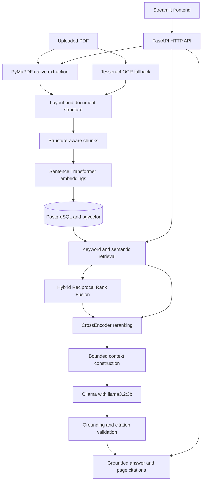
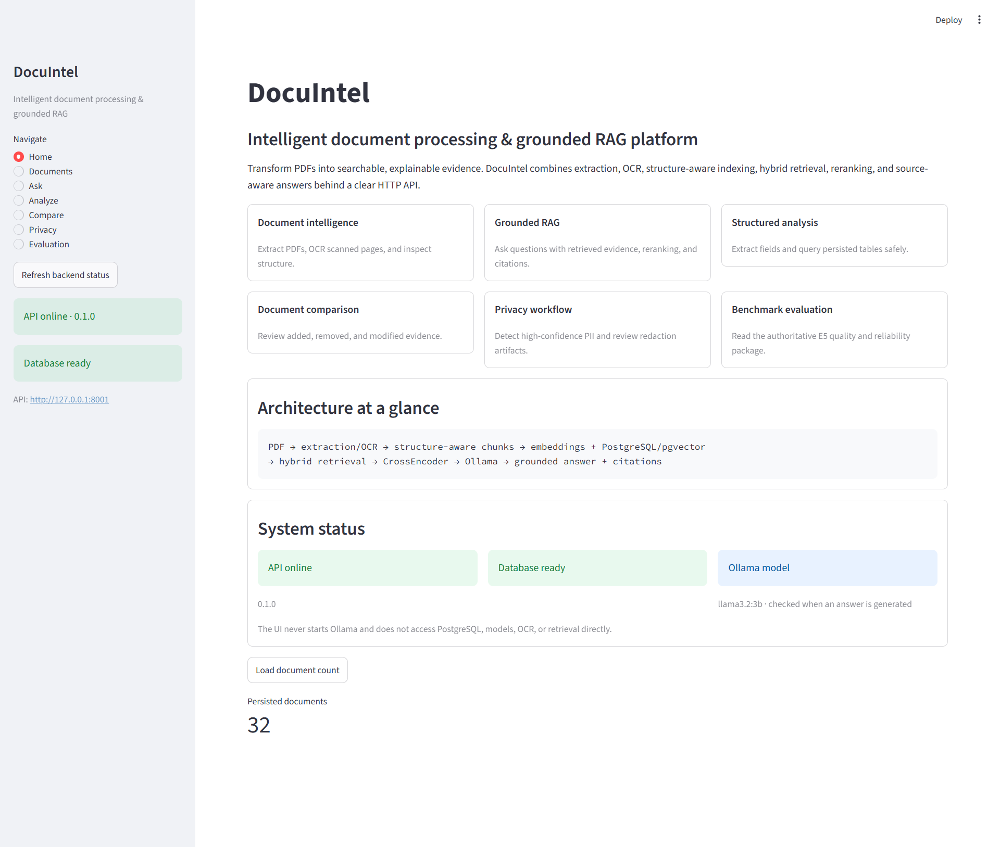
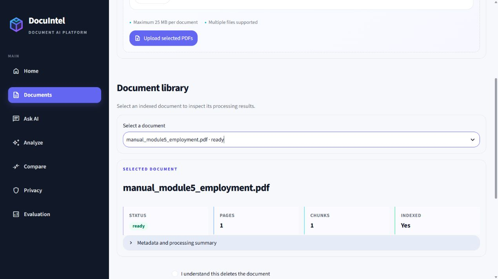
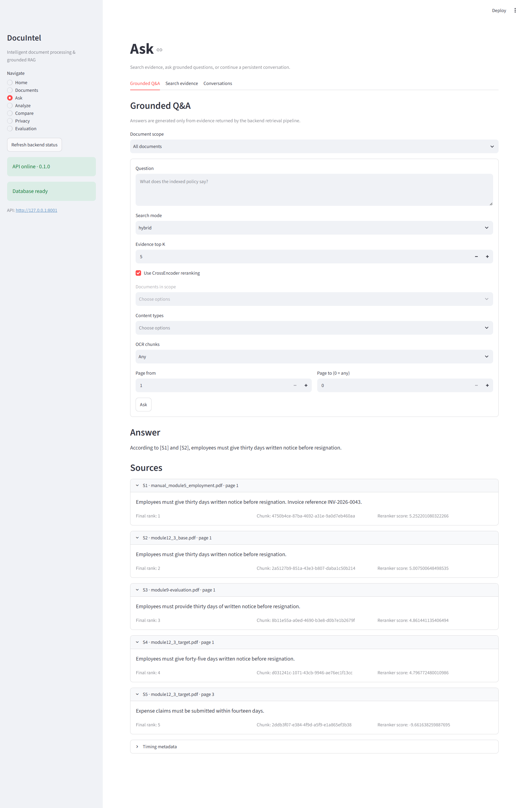
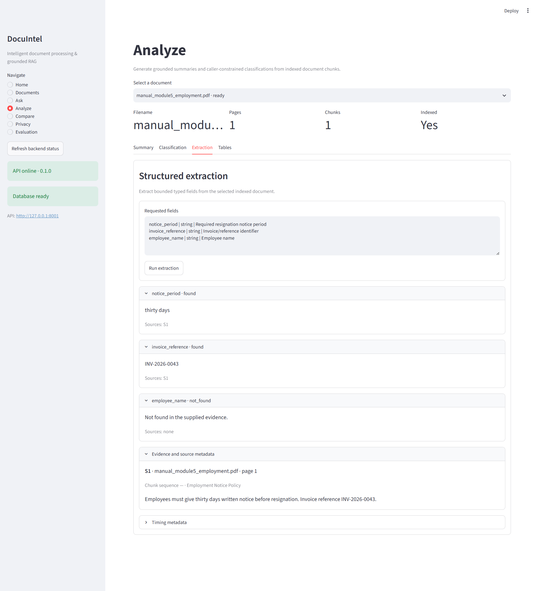
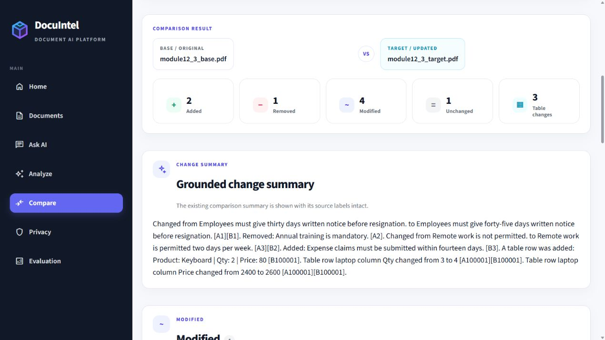
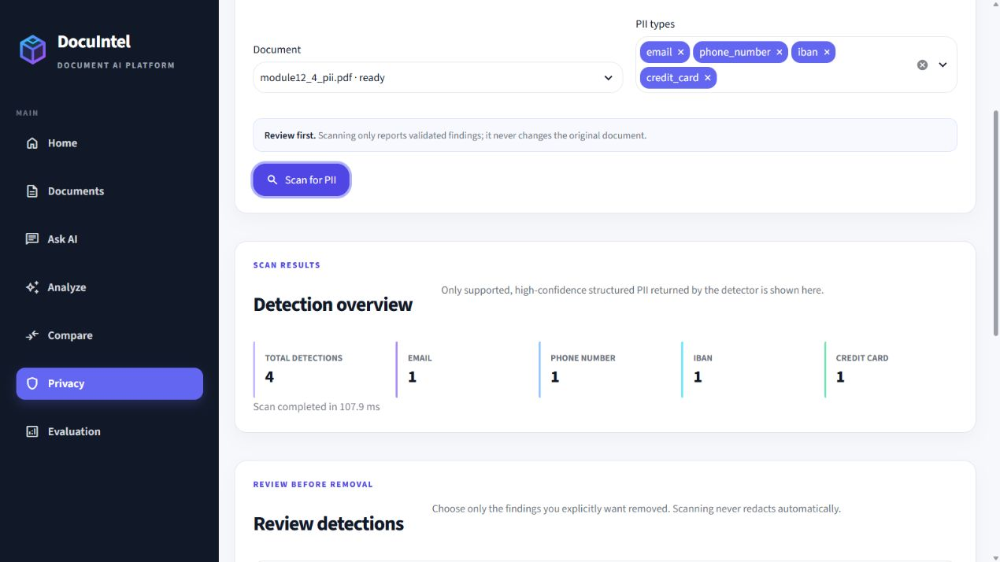
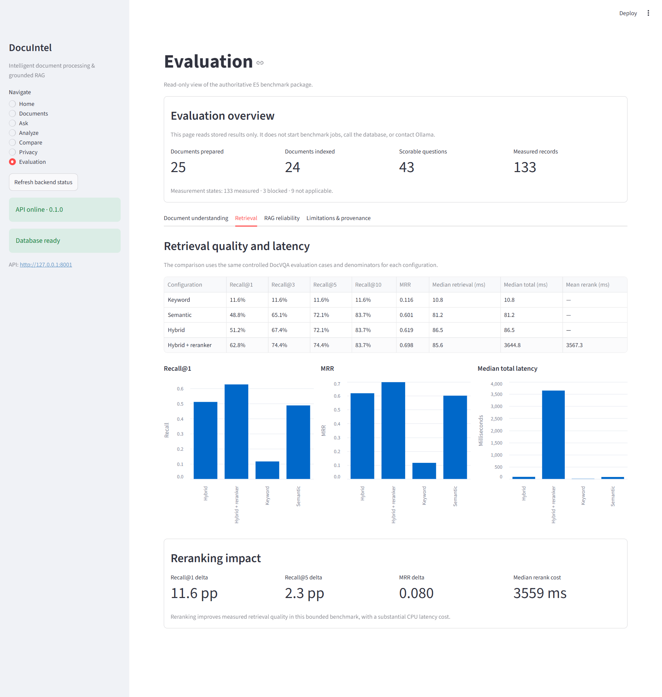

# DocuIntel

## Intelligent Document Processing and Grounded RAG Platform

DocuIntel is an end-to-end document intelligence platform for turning native
and scanned PDFs into searchable, explainable evidence. It combines PDF
ingestion, native extraction, OCR, layout-aware processing, structure-aware
chunking, embeddings, PostgreSQL with pgvector, keyword and semantic hybrid
retrieval, CrossEncoder reranking, grounded local LLM generation, source
citations, structured extraction, deterministic table analytics, document
comparison, PII detection and redaction, and reproducible benchmarking.

The application is complete for the current Modules 0–13 scope. It is a
portfolio-quality reference implementation rather than a claim of universal
document accuracy or unrestricted production readiness.

## Key capabilities

- Native PDF ingestion with PyMuPDF and selective Tesseract OCR
- Heuristic layout and document-structure extraction
- Structure-aware chunking and `sentence-transformers/all-MiniLM-L6-v2` embeddings
- PostgreSQL and pgvector persistence
- Keyword, semantic, and hybrid search with Reciprocal Rank Fusion
- Optional `cross-encoder/ms-marco-MiniLM-L6-v2` reranking over a bounded candidate pool
- Grounded single-document and explicit multi-document Q&A
- Persistent multi-turn conversations with stored message history
- Source excerpts, page metadata, citation validation, and timing metadata
- Grounded document summarization and caller-constrained document classification
- Evidence-grounded structured field extraction
- Table inventory, preview, and deterministic natural-language table queries
- Structured table comparison and document-version change detection
- High-confidence email, phone, IBAN, and payment-card detection
- Review-first selective PDF redaction with unchanged originals
- Read-only E1–E5 evaluation tooling and a Streamlit evaluation dashboard

## Architecture



The Streamlit application is an HTTP-only presentation layer. Business logic,
database access, retrieval, reranking, OCR, and local LLM access remain behind
FastAPI services. Ollama is an external local HTTP service; DocuIntel does not
start `ollama.exe` or select CPU/GPU hardware.

## Reviewer quick start

```powershell
git clone https://github.com/ronitloke/DocuIntel.git
cd DocuIntel
Copy-Item .env.example .env
ollama pull llama3.2:3b
docker compose up --build -d
python scripts/check_deployment.py
python scripts/bootstrap_demo.py
```

Open <http://localhost:8501>. Host ports are configurable through `API_PORT`,
`STREAMLIT_PORT`, and `POSTGRES_PORT` in `.env`; use matching URL overrides for
the two scripts when those ports change. See [docs/DEMO.md](docs/DEMO.md) for
the prepared reviewer walkthrough.

## Application Screenshots

The Streamlit interface exposes DocuIntel's document intelligence, grounded
RAG, structured analysis, privacy, and benchmark workflows through the FastAPI
backend.

### Home

Platform overview showing document-intelligence capabilities, the processing
pipeline, and persisted document state.



### Documents

Upload and manage documents, inspect processing state, and review persisted
extraction and indexing details for a selected synthetic fixture.



### Grounded Q&A

Hybrid retrieval generates a source-grounded answer with page-level evidence
citations and an expandable supporting excerpt.



### Analyze

Typed field extraction returns grounded values for the resignation notice
period and invoice reference while explicitly marking unsupported employee
information as not found.



### Document Comparison

Version-aware comparison identifies added, removed, and modified text and
structured table changes between document revisions.



### Privacy & Redaction

Local PII detection identifies email, phone number, IBAN, and credit-card
values and allows explicit selective redaction rather than automatic removal.



### Benchmark Evaluation

Read-only benchmark dashboard compares keyword, semantic, hybrid, and
CrossEncoder-reranked retrieval while exposing measured ranking-quality and
latency trade-offs.



## Technology stack

- Python 3.12
- FastAPI and Uvicorn
- Streamlit
- PostgreSQL and pgvector
- PyMuPDF and Tesseract OCR
- `sentence-transformers/all-MiniLM-L6-v2` embeddings (384 dimensions)
- `cross-encoder/ms-marco-MiniLM-L6-v2` reranking
- Ollama with the configurable `llama3.2:3b` local model
- Docker Compose
- SQLAlchemy and Alembic
- pytest and pytest-cov

## Measured retrieval benchmark

The published summary is derived from the authoritative E5 package without
including the local raw result tree. See
[`evaluation/public/e5_benchmark_summary.json`](evaluation/public/e5_benchmark_summary.json).

Scope: official DocVQA validation data, 100 questions attempted, 43
answer-indexable/scorable questions, 25 documents prepared, and 24 documents
indexed. Retrieval metrics are conditional on those 43 scorable questions.
No generic DocuIntel accuracy percentage is calculated.

| Configuration | Recall at 1 | Recall at 5 | Recall at 10 | MRR | Median retrieval ms | Median total ms |
|---|---:|---:|---:|---:|---:|---:|
| Keyword | 11.63% | 11.63% | 11.63% | 0.116279 | 10.771 | 10.785 |
| Semantic | 48.84% | 72.09% | 83.72% | 0.601061 | 81.231 | 81.247 |
| Hybrid | 51.16% | 72.09% | 83.72% | 0.618503 | 86.474 | 86.496 |
| Hybrid + CrossEncoder | 62.79% | 74.42% | 83.72% | 0.698413 | 85.641 | 3644.850 |

CrossEncoder reranking improved Hybrid Recall at 1 from 51.16% to 62.79%
(11.63 percentage points) and MRR from 0.618503 to 0.698413. Recall at 10
reached 83.72% on this bounded evaluation. The improvement added a measured
3558.354 ms to median total latency, primarily from reranking.

These results demonstrate a quality-versus-latency trade-off, not a universal
ranking guarantee. The evaluation sample is controlled and limited in size.

## Evaluation coverage

The E1–E5 framework covers DocVQA, FUNSD, and DocLayNet. It measures OCR
character and word error rates, layout precision, recall, F1 and matched IoU,
retrieval Recall at K, MRR, retrieval/reranking latency, RAG completion and
reliability, citation grounding, and explicit blocked/not-measured states.

The full downloaded datasets, raw images, prepared PDFs, per-question answer
payloads, and local benchmark result directories are intentionally excluded
from Git. Dataset adapters, manifests, schemas, runners, and the sanitized
benchmark summary remain available for reproducibility.

## Grounding, privacy, and safety engineering

- Local Ollama HTTP generation keeps the LLM provider on the developer machine.
- Retrieved document text is treated as untrusted data, not executable instructions.
- Context uses stable source labels and source metadata.
- Citation labels and claim-level evidence are validated with fail-closed behavior.
- Empty retrieval does not call the LLM to guess an answer.
- PII detection uses deterministic email, phone, IBAN, and Luhn-validated card checks.
- Redaction requires explicit review and server-issued detection IDs.
- Native redaction resolves exact PDF word coordinates; uncertain OCR coordinates fail closed.
- Redaction creates a derivative PDF and leaves the original unchanged.

## Known limitations

- The E4 bounded end-to-end RAG run experienced frequent timeouts with CPU-mode
  Ollama; this is a local runtime reliability result, not a general accuracy
  score.
- Retrieval quality was substantially stronger than full local generation reliability.
- One evaluation document exceeded the unchanged 25 MB upload limit.
- Retrieval scores are conditional on answer-indexable questions, not all attempted questions.
- OCR and heuristic layout extraction remain areas for improvement.
- The project does not implement authentication, user accounts, cloud LLM providers, web search, agents, async job orchestration, or a conversational frontend beyond the implemented local Streamlit workflow.

## Repository structure

```text
app/                    FastAPI routes, services, persistence, and models
streamlit_app/          HTTP-only Streamlit presentation layer
evaluation/             Dataset adapters, E1–E5 schemas, runners, and reports
evaluation/public/      Sanitized benchmark evidence intended for Git
scripts/                Local sample, evaluation, and verification commands
tests/                  Unit, integration-gated, evaluation, and performance tests
alembic/                Database migration environment and revisions
data/sample_pdfs/       Reviewed synthetic PDF fixtures
docs/images/            Reviewed application screenshots
.github/workflows/      CI configuration
```

Downloaded datasets, uploaded PDFs, generated redacted PDFs, model caches,
pytest runtime directories, local database state, and authoritative evaluation
payloads remain local-only through `.gitignore`.

## Docker Compose quick start

This is the reproducible local deployment path for reviewers and fresh
machines. It runs PostgreSQL/pgvector, the FastAPI API, and the Streamlit UI in
Compose. Ollama remains a host service so Windows GPU/CPU selection stays an
Ollama concern rather than an application concern.

Prerequisites:

- Docker Desktop with the Linux container engine running
- Ollama installed on the host
- The `llama3.2:3b` model available locally

Prepare the safe local environment file and the host model:

```powershell
Copy-Item .env.example .env
ollama pull llama3.2:3b
```

The example password is suitable only for a new local volume. If reusing an
existing PostgreSQL volume, set `POSTGRES_PASSWORD` in `.env` to that volume's
original password before starting Compose.

For Docker Desktop, the Compose API container reaches host Ollama through
`http://host.docker.internal:11434`. If Ollama is not already listening on a
host-reachable interface, start it in a PowerShell window with:

```powershell
$env:OLLAMA_HOST="0.0.0.0:11434"
ollama serve
```

Then start the complete stack with one command:

```powershell
docker compose up --build
```

Open the application at <http://localhost:8501>. The API is available at
<http://localhost:8001>, with health and readiness at `/health` and `/ready`.
The migration service waits for PostgreSQL's health check and runs
`alembic upgrade head` before the API starts accepting traffic. The database
schema therefore reaches `0004_module8_conversations` deterministically.

### Deployment health and troubleshooting

Check the complete dependency chain with:

```powershell
docker compose ps
docker compose logs docuintel-postgres
docker compose logs docuintel-migrate
docker compose logs docuintel-api
docker compose logs docuintel-frontend
python scripts/check_deployment.py
```

Healthy startup shows PostgreSQL healthy, `docuintel-migrate` exited with code
0, and both `docuintel-api` and `docuintel-frontend` healthy. The diagnostic
command requires FastAPI health/readiness and Streamlit to pass. Ollama is
optional for core startup, so an unavailable Ollama service is reported as a
warning and causes only generation-dependent features to fail safely.

If PostgreSQL is stopped, `/health` can remain a lightweight process-liveness
check while `/ready` returns HTTP 503 with `database: unavailable`; restart
PostgreSQL and the API readiness check recovers without deleting named volumes.
If Ollama is stopped, document management and retrieval remain available, while
RAG, summaries, classification, and other language-model operations return a
controlled service-unavailable response. The API never starts Ollama itself.

Stop the services without deleting persisted local state:

```powershell
docker compose down
```

PostgreSQL data, uploaded/generated runtime files, and the transformer cache
use named Docker volumes. The first indexing or reranking request may download
`sentence-transformers/all-MiniLM-L6-v2` and
`cross-encoder/ms-marco-MiniLM-L6-v2`; subsequent starts reuse the model-cache
volume. Models are deliberately not baked into the image or committed to Git.
The backend image includes Linux Tesseract and resolves it from the container
PATH. The Streamlit container communicates only with FastAPI and never accesses
PostgreSQL directly.

Troubleshooting:

- Run `docker compose ps` and `docker compose logs docuintel-migrate docuintel-api docuintel-frontend` to inspect startup.
- If the API waits, confirm the PostgreSQL health check is healthy and that `POSTGRES_PASSWORD` is set in `.env`.
- If generation is unavailable, confirm `ollama serve`, `ollama list`, and the `OLLAMA_BASE_URL`/`OLLAMA_MODEL` values. A host firewall may need to allow Docker Desktop's private-network connection to port `11434`.
- Change `API_PORT`, `STREAMLIT_PORT`, or `POSTGRES_PORT` in `.env` if a host port is already in use. The API's internal database port remains `5432`.
- `docker compose down -v` intentionally removes the Compose named volumes and is only for a deliberate local reset.

### Quick demo

After the deployment is healthy, populate the reviewed synthetic corpus and
open the Streamlit application:

```powershell
python scripts/check_deployment.py
python scripts/bootstrap_demo.py
```

Open <http://localhost:8501>. The bootstrap uses the existing FastAPI upload
and indexing contracts, is safe to run repeatedly, and never deletes existing
documents or resets volumes. See [docs/DEMO.md](docs/DEMO.md) for the prepared
Q&A, search, analysis, table, comparison, privacy, and OCR walkthroughs.

## Local setup on Windows

The commands below assume PowerShell and Python 3.12.

```powershell
git clone <repository-url>
cd DocuIntel
py -3.12 -m venv .venv
.\.venv\Scripts\Activate.ps1
python -m pip install --upgrade pip
python -m pip install -r requirements-dev.txt
```

Evaluation dataset preparation is optional:

```powershell
python -m pip install -r requirements-eval.txt
```

Create local configuration and replace the database placeholder with a local
password. Never commit `.env`:

```powershell
Copy-Item .env.example .env
```

For a host-run FastAPI process, set `OLLAMA_BASE_URL=http://127.0.0.1:11434`
in `.env`. Start PostgreSQL with pgvector on the project host port `55432`:

```powershell
docker compose up -d docuintel-postgres
docker compose ps
python -m alembic upgrade head
```

The current migration head is `0004_module8_conversations`.

Start FastAPI on the documented local port:

```powershell
python -m uvicorn app.main:app --host 127.0.0.1 --port 8001 --reload
```

Verify health and readiness at <http://127.0.0.1:8001/health> and
<http://127.0.0.1:8001/ready>. Swagger/OpenAPI is available at
<http://127.0.0.1:8001/docs>.

Install and start Ollama separately, then make the configured model available:

```powershell
ollama pull llama3.2:3b
ollama serve
```

DocuIntel communicates with Ollama at `http://127.0.0.1:11434` and does not
require the Ollama executable to be managed by FastAPI.

Start Streamlit in a second PowerShell window. Use any available local port;
8501 is the normal default:

```powershell
$env:DOCUINTEL_API_BASE_URL="http://127.0.0.1:8001"
python -m streamlit run streamlit_app/app.py --server.port 8501
```

Major API groups include health/readiness, document upload and indexing,
search, grounded Q&A, conversations, analysis, structured extraction and
tables, comparison, privacy detection/redaction, and generated-artifact
download.

## Reproducible evaluation commands

The evaluation layer is read-only with respect to the production database and
application algorithms. Dataset payloads are bounded and must be obtained from
their official sources by the user; they are not distributed here.

```powershell
python scripts/evaluation_prepare.py --dataset doclaynet --split validation --limit 5
python scripts/evaluation_prepare.py --dataset funsd --split test --limit 5
python scripts/evaluation_prepare.py --dataset docvqa --source-dir data/evaluation/raw/docvqa --split validation --limit 25
python -m app.evaluation.cli compare --dataset evaluation/datasets/sample.json --top-k 5 --include-rerank
```

The generated raw and processed payloads belong under ignored
`data/evaluation/` directories. The small public E5 summary is a sanitized
publication artifact, not a replacement for the authoritative local package.

## Testing

The latest verified local suite is:

```text
319 passed, 28 skipped, 1 existing warning
```

The CI-equivalent suite, with `TEST_DATABASE_URL` enabled against PostgreSQL,
is verified at:

```text
324 passed, 3 skipped, 1 existing warning
```

The warning is the existing Starlette/httpx deprecation warning. Skips are
intentional environment-gated PostgreSQL/Ollama integration checks, not test
failures.

Run the normal suite with either invocation:

```powershell
pytest
python -m pytest
python -m pip check
python -m compileall -q app streamlit_app evaluation scripts
```

Pytest is configured with project-local `.pytest_tmp` and `.pytest_cache`
directories so Windows runs do not depend on the user profile's temporary
directory. Evaluation regression tests are included in the complete suite.

## License

This repository's original source code and synthetic fixtures are released
under the MIT License. The license does not relicense DocVQA, FUNSD, DocLayNet,
Ollama, Tesseract, Sentence Transformers, CrossEncoder models, or other
third-party dependencies and datasets; those resources retain their own
licenses. Downloaded dataset payloads are not included in this repository.

## Scope boundary

Modules 0–12.4, Evaluation E1–E5, and Module 13 are complete for this
repository. Module 14 and later product capabilities are intentionally outside
this publication release.
